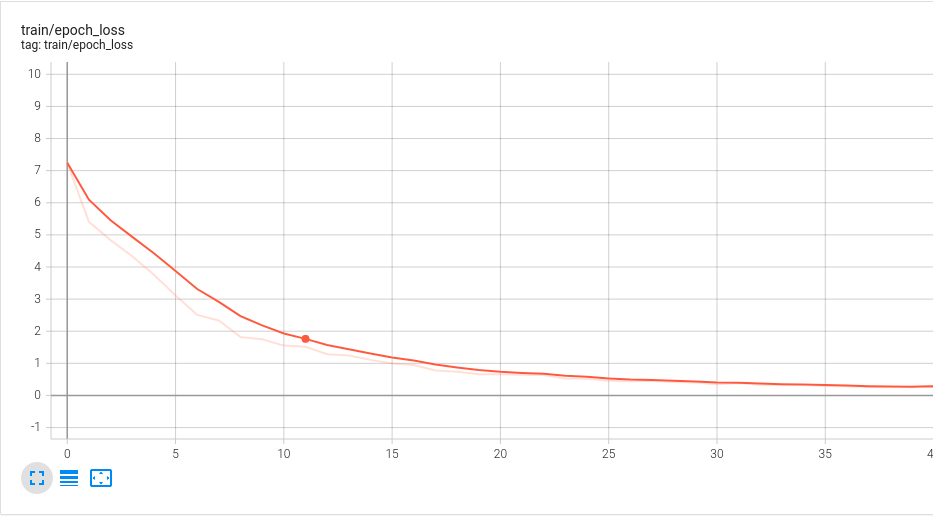

# CMC_MoCo
This repo implements the algorithm Contrastive Multiview coding (CMC), initially implemented [here](https://github.com/HobbitLong/CMC/), combined with Momentum Contrast (MoCo).
The final model is an image encoder which outputs vector of fixed sized (default 128).

We use the [STL-10 dataset](https://cs.stanford.edu/~acoates/stl10/) to train the encoder. The backbone models used to encode are AlexNet, ResNet-50 and EfficientNet-b0.

<p align="center">
  
</p>

We evaluate our encoder via a classification task on the STL-10 dataset by adding a 10-feature-output MLP model at the top of our encoder. We also evaluate 
the final classification score at different layers of the backbone model.

The encoder is adapted to be used with numerous colorspace having two or more views such as Lab, YDbDr, YPbPr.

## Installation

* Install conda environment
```shell
conda env create -f env.yml
```
* Download STL-10 dataset
```shell
python stl10_input.py
```

## Training

* Check configs in ``cfgs/config.yaml``
* Train the AlexNet encoder
```shell
python train
```
* Show metric evolutions in tensorboard
```shell
tensorboard --logdir exp_local
```
<p align="center">
  
</p>

## Resources
* [Contrastive Multiview Coding (CMC) paper](https://arxiv.org/abs/1906.05849)
* [Momentum Contrast (MoCo) paper](https://arxiv.org/abs/1911.05722)
* [Mastering Visual Continuous Control: Improved Data-Augmented Reinforcement Learning](https://arxiv.org/abs/2107.09645)
